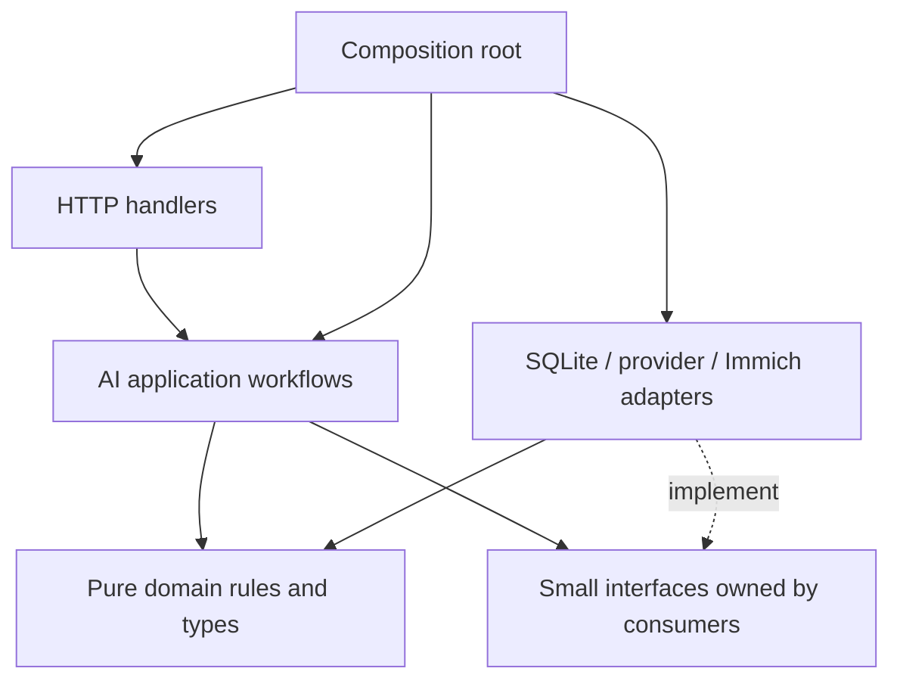

# Architecture rules

**Status:** Adopted 17 September 2026. Governs new AI functionality and code changed to integrate it. Existing manual and GPX workflows must remain usable. This is a design contract, not a claim that the AI modules exist.

This document owns repository architecture rules. The [AI technical design](../ai-locate/TECHNICAL_DESIGN.md) owns feature-specific contracts; the [PRD](../ai-locate/PRD.md) owns product outcomes. Follow [coding standards](coding-standards.md) and [testing](testing.md) alongside this document.

## Deployment and package ownership

Keep one Go backend, one Next.js frontend and the existing local SQLite database with Goose migrations. Do not add a worker service, queue broker, ORM, second catalog, new database engine or direct Immich database access for V1.

Put new AI core behavior in small, feature-focused packages under `backend/internal/ai/`. Create packages as real boundaries appear; analysis, jobs, review and writeback are expected owners, with shared model types only where actual consumers need them. Do not scaffold an empty hierarchy or rewrite the existing backend.

Existing `package main` remains the composition/integration boundary. Thin handlers and adapters can wrap its existing auth, asset/client and database services. New SQL and external transports belong to persistence/transport adapters outside the core workflow packages. Core packages must not import `package main`; adapters translate between legacy unexported types and explicit core contracts.

[ADR-07](decisions/ADR-07-ai-internal-packages.md) records this amendment to the package's original flat-file plan. The change that first introduces subpackages must update and verify the backend Docker build: the pinned Dockerfile only copies root Go files and migrations. Existing migration ownership and numbering stay under `backend/migrations/`.

## Dependency rules

1. Handlers authenticate, decode/validate, call a use case and map its result. They do not contain SQL, inference loops, retry policy or writeback decisions.
2. Core workflows/domain rules do not depend on handlers, SQLite drivers, concrete external clients or frontend concerns. The composition root can know both interfaces and implementations.
3. Domain decisions are deterministic: no hidden network, filesystem, environment or wall-clock access. Inject nondeterministic inputs when required.
4. Analysis receives read-only asset interfaces. It cannot depend on the confirmed writer, mutation client or legacy stack-expanding location handler. Verify imports and observable no-write behavior; Go's `internal` visibility alone does not prevent sibling imports.
5. Writeback is the only AI component allowed to invoke Immich mutations. It requires a durable confirmed plan. A model response, frontend boolean, result ID or editable draft is not write authority.
6. The worker owns analysis attempt budgets; the confirmed writer owns mutation reconciliation and retries. Disable hidden retries in the AI mutation transport/browser helper. Preserve the legacy manual path unless its behavior is explicitly being changed.
7. No dependency cycles or deep imports into another feature's private state. Cross-feature interactions use a narrow contract. Shared code needs a demonstrated common purpose.
8. Persistence adapters own SQL, revision checks and transactions. Policy evaluation does not require a SQL string or concrete database connection. Never hold a database transaction open across a network call.

## Frontend rules

- Keep AI UI, hooks, state and API DTO handling under `src/features/ai/`. Expose a small integration surface to the existing shell, map and selection features.
- Components render and dispatch user intentions. Hooks coordinate state and requests. Pure validation, formatting and transitions live outside React/Leaflet.
- Centralize the AI API boundary using the existing backend proxy/client convention. Do not scatter raw fetches or provider/Immich credentials across components.
- Separate server state, local editing state and map presentation. Refer to durable drafts by ID/revision; do not put complete analyses in the global pending-coordinate context.
- Preserve feature ownership and avoid circular/deep private imports. Existing shared contexts are integration points, not an unrestricted store for AI jobs/history.
- Controls need accessible names and keyboard behavior. Provide numeric coordinate/direction alternatives and textual state labels.

## Data and external boundaries

- Separate provider-output contracts, application DTOs and persistence records. Validate conversions and preserve snake_case/camelCase conventions at their boundaries.
- Enforce user and installation scope at every protected operation and lookup, including joins and background work. Client filtering is not authorization; recheck access before sensitive dispatch/write operations.
- Missing values are explicit; zero is a valid coordinate. Use the same documented source-local capture-date interpretation for filtering, counts, snapshots and context.
- Persist immutable analyses, revisioned drafts and confirmed write operations separately. Define their state transitions and owners instead of using one generic status field.
- Every network operation has a context/deadline, bounded payload and explicit retry policy. Model and external text remain untrusted inputs.
- Use additive, ordered migrations; never edit an applied migration. Verify fresh and upgraded databases, and state a recovery strategy. Do not assume destructive down-migrations are safe.
- Keep secrets, image bytes and private payloads out of ordinary logs, serialized errors and telemetry. Bind image/context egress to consent and administrator destination policy.

## Decisions and changes

Record a consequential architectural departure in an ADR with its requirement, alternatives, consequences and affected documents. Amend the applicable standard and technical design together; an individual change's design cannot silently override them. Routine choices within the accepted boundaries need no extra approval. Keep future Research/search interfaces deferred until an accepted consumer requires them.
