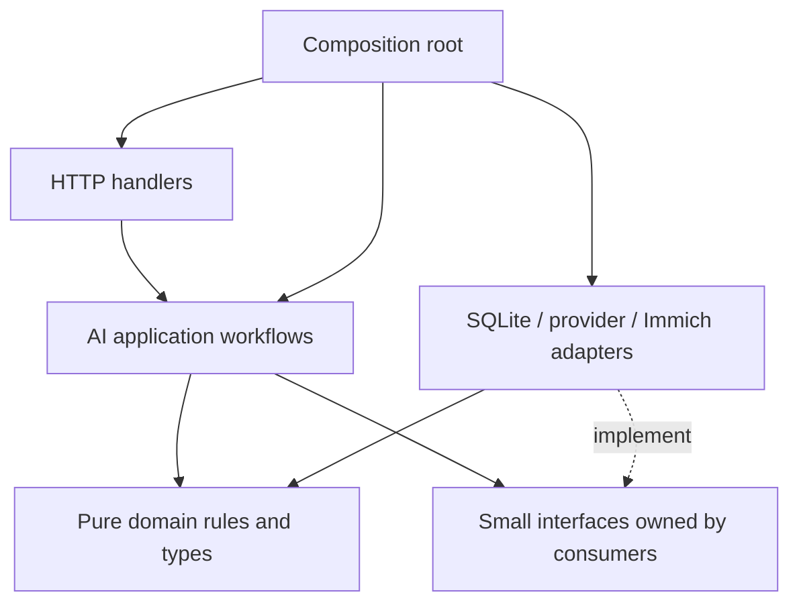

# Architecture rules

**Status:** Adopted 17 September 2026. Governs new AI functionality and code changed to integrate it. Existing manual and GPX workflows must remain usable. This is a design contract, not a claim that the AI modules exist.

This document owns repository architecture rules. The [AI technical design](../ai-locate/TECHNICAL_DESIGN.md) owns feature-specific contracts; the [PRD](../ai-locate/PRD.md) owns product outcomes. Follow [coding standards](coding-standards.md) and [testing](testing.md) alongside this document.

## Deployment and package ownership

Keep one Go backend, one Next.js frontend and the existing local SQLite database with Goose migrations. Do not add a worker service, queue broker, ORM, second catalog, new database engine or direct Immich database access for V1.

Put new AI core behavior in small, feature-focused packages under `backend/internal/ai/`. Create packages as real boundaries appear; analysis, jobs, review and writeback are expected owners, with shared model types only where actual consumers need them. Do not scaffold an empty hierarchy or rewrite the existing backend.

Existing `package main` remains the composition/integration boundary. Thin handlers and adapters can wrap its existing auth, asset/client and database services. New SQL and external transports belong to persistence/transport adapters outside the core workflow packages. Core packages must not import `package main`; adapters translate between legacy unexported types and explicit core contracts.

[ADR-07](decisions/ADR-07-ai-internal-packages.md) records this amendment to the package's original flat-file plan. The change that first introduces subpackages must update and verify the backend Docker build: the pinned Dockerfile only copies root Go files and migrations. Existing migration ownership and numbering stay under `backend/migrations/`.

## Dependency rules

1. Handlers authenticate, decode/validate, call a use case and map its result. They do not contain SQL, inference loops, retry policy or writeback decisions.
2. Core workflows/domain rules do not depend on handlers, SQLite drivers, concrete external clients or frontend concerns. The composition root can know both interfaces and implementations.
3. Domain decisions are deterministic: no hidden network, filesystem, environment or wall-clock access. Inject nondeterministic inputs when required.
4. Analysis receives read-only asset interfaces. It cannot depend on the confirmed writer, mutation client or legacy stack-expanding location handler. Verify imports and observable no-write behavior; Go's `internal` visibility alone does not prevent sibling imports.
5. Writeback is the only AI component allowed to invoke Immich mutations. It requires a durable confirmed plan. A model response, frontend boolean, result ID or editable draft is not write authority.
6. The worker owns analysis attempt budgets; the confirmed writer owns mutation reconciliation and retries. Disable hidden retries in the AI mutation transport/browser helper. Preserve the legacy manual path unless its behavior is explicitly being changed.
7. No dependency cycles or deep imports into another feature's private state. Cross-feature interactions use a narrow contract. Shared code needs a demonstrated common purpose.
8. Persistence adapters own SQL, revision checks and transactions. Policy evaluation does not require a SQL string or concrete database connection. Never hold a database transaction open across a network call.

## Frontend rules

- Keep AI UI, hooks, state and API DTO handling under `src/features/ai/`. Expose a small integration surface to the existing shell, map and selection features.
- Components render and dispatch user intentions. Hooks coordinate state and requests. Pure validation, formatting and transitions live outside React/Leaflet.
- Centralize the AI API boundary using the existing backend proxy/client convention. Do not scatter raw fetches or provider/Immich credentials across components.
- Separate server state, local editing state and map presentation. Refer to durable drafts by ID/revision; do not put complete analyses in the global pending-coordinate context.
- Preserve feature ownership and avoid circular/deep private imports. Existing shared contexts are integration points, not an unrestricted store for AI jobs/history.
- Controls need accessible names and keyboard behavior. Provide numeric coordinate/direction alternatives and textual state labels.

## Data and external boundaries

- Separate provider-output contracts, application DTOs and persistence records. Validate conversions and preserve snake_case/camelCase conventions at their boundaries.
- Enforce user and installation scope at every protected operation and lookup, including joins and background work. Client filtering is not authorization; recheck access before sensitive dispatch/write operations.
- Missing values are explicit; zero is a valid coordinate. Use the same documented source-local capture-date interpretation for filtering, counts, snapshots and context.
- Persist immutable analyses, revisioned drafts and confirmed write operations separately. Define their state transitions and owners instead of using one generic status field.
- Every network operation has a context/deadline, bounded payload and explicit retry policy. Model and external text remain untrusted inputs.
- Use additive, ordered migrations; never edit an applied migration. Verify fresh and upgraded databases, and state a recovery strategy. Do not assume destructive down-migrations are safe.
- Keep secrets, image bytes and private payloads out of ordinary logs, serialized errors and telemetry. Bind image/context egress to consent and administrator destination policy.

## Codebase analysis and change verification

Use GitNexus as the first tool for codebase relationships during planning, implementation, debugging, refactoring and review. These project-owned rules supplement the generated GitNexus section in `AGENTS.md` and remain in force when that section is regenerated.

Bind every query to `immich-places-ai-addon` and confirm the repository path, checkout and indexed revision. Read the repository context and the relevant local GitNexus skill before using its workflow. Refresh a stale index before relying on it; include uncommitted source changes in the freshness assessment. Use the CLI fallback when MCP is unavailable. If indexing or analysis remains unavailable, report that limitation and the source/test evidence used instead; never report the GitNexus gate as passed.

| Work | Required GitNexus use |
|---|---|
| Understand a feature, debug behavior or plan integration | Start with `query` for concepts and execution flows, then `context` for relevant symbols. Use `trace` when following a path between symbols. Verify the actual source at the identified boundaries. |
| Edit an existing function, class, method or shared contract | Run upstream `impact` first; inspect direct callers, affected processes and tests. Report the affected behavior and risk before editing. Warn on HIGH/CRITICAL risk; a lower shared-axis score does not waive that warning. |
| Rename, move, extract or reorganize code | Inspect callers and dependencies first. Preview symbol renames with `rename`, review both graph and text matches, then verify the resulting diff. Do not use blind find-and-replace for symbol renames. |
| Change package or feature dependencies | Inspect import relationships and run `check` for cycles. For frontend/backend API contracts, use `route_map`, `api_impact` and `shape_check` where the indexed language and route support apply. Retain the repository's source-based boundary checks. |
| Investigate security-sensitive data/control flow | Use `explain` or `pdg_query` when the required PDG index is available. Confirm authorization, validation and mutation boundaries in source and behavioral tests; no finding is not proof of safety. |
| Review a change or prepare a commit | Run `detect_changes` against the intended checkout, using all local changes before a commit and an explicit base for branch review. Inspect unexpected symbols/processes and choose regression tests for affected behavior. Re-run after subsequent relevant edits. |

Treat `UNKNOWN`, empty results for new/unindexed symbols, stale data, `partial`, `truncated`, and lower-bound results as uncertainty, not evidence of no impact. Retry, refresh, disambiguate or paginate as applicable, then verify unresolved relationships with targeted source searches and tests. A capped cycle listing is not a clean cycle check. Report remaining gaps; do not keep retrying an unchanged query or silently bypass a mandatory check.

Use `rg` for literal/configuration/file searches and to investigate unsupported or unresolved relationships after the graph query. GitNexus narrows where to look and what to test; it does not replace source reading, type checks, deterministic import rules, behavioral tests or human review. Documentation-only changes need document/configuration verification rather than artificial symbol-impact calls; any commit still requires the change analysis above.

## Installed checks and limits

The F01 [shared verification command](testing.md#available-commands-and-remaining-setup) installs source-based dependency checks alongside size, formatting, lint, types, backend tests and builds. `bun run check:dependencies --base <revision>` resolves static frontend imports/re-exports through the existing TypeScript configuration, reports inherited runtime cycles and rejects new cycles or any AI cycle. Inbound imports to `src/features/ai/` use its root public index; internal AI imports and existing shared contracts remain allowed. Go core packages under `backend/internal/ai/` cannot import executable, concrete adapter/client/driver packages; analysis cannot transitively reach writer/mutation packages.

These structural checks are independent of GitNexus and do not prove runtime authorization, absence of side effects or computed/dynamic loading behavior. Concrete rules must grow with real AI packages; Go builds remain authoritative for Go language validity and import cycles. F02 provides frontend unit/component tests and the future AI coverage policy. F03 exercises the real built frontend, proxy, backend and SQLite with synthetic external fixtures for auth, manual placement and GPX. There is no AI implementation or measured AI coverage at this stage; backend AI coverage enforcement remains pending.

## Decisions and changes

Record a consequential architectural departure in an ADR with its requirement, alternatives, consequences and affected documents. Amend the applicable standard and technical design together; an individual change's design cannot silently override them. Routine choices within the accepted boundaries need no extra approval. Keep future Research/search interfaces deferred until an accepted consumer requires them.
